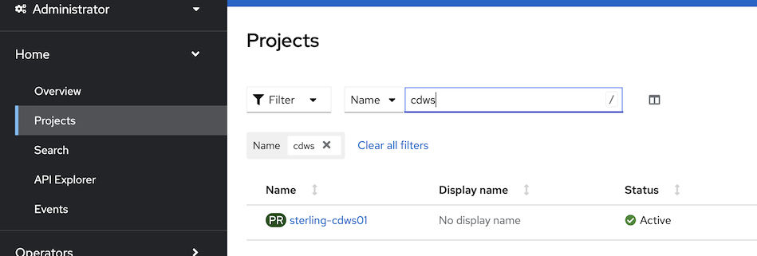

# Deploy IBM Sterling Connect:Direct WebService on OpenShift using Ansible Scripts

Playbook will run the last version of Connect:Direct WebService, but take care of Kubernetes/Openshift version is supported

| C:D WebService            | OpenShift           | Kubernetes          | helm-chart |
|---------------------------|---------------------|---------------------|------------|
| 6.4.0.2_ifix001           | >= 4.14 and <= 4.18 | >=1.27.0 <1.32.0    | 1.1.6      |
| 6.4.0.2_ifix000           | >= 4.14 and <= 4.18 | >=1.27.0 <1.32.0    | 1.1.5      |
| 6.4.0.0_ifix000           | >= 4.14 and <= 4.16 | >=1.27.0 <1.30.0    | 1.1.0      |
| 6.3.0.11_ifix000          | >= 4.14 and <= 4.16 | >=1.27.0 <1.30.0    | 1.0.4      |
| 6.3.0.9_ifix000           | >= 4.14 and <= 4.16 | >=1.27.0 <1.30.0    | 1.0.2      |


## Preparation

### 1. IBM Entitled Registry

You must have **kubectl**, **oc**, **git** and **ansible** installed in your machine

Log in the [IBM Container software library](https://myibm.ibm.com/products-services/containerlibrary) with the IBMid and password that are associated with the entitled software. Click **Get entitlement key**. With key export variable

```bash 
export ENTITLED_REGISTRY_KEY=<entitlement_key>
```

### 2. Login on OpenShift

Do a login in Openshift console and run the command:

```bash 
oc login --token=sha256~P...k --server=https://c....containers.cloud.xxx.com:31234
```

### 3. Cloning ansible-ibm-sterling from git

```bash 
git clone https://github.com/ibm-sterling-devops/ansible-ibm-sterling.git
```

### 4. Set roles path

To run playbook the playbook

```bash 
cd ansible-ibm-sterling

export ANSIBLE_CONFIG=./ansible.cfg 
```

## Deploy you Connect:Direct WebService

1) To run the playbook

```bash 
ansible-playbook playbooks/deploy_cdws.yml
```

check for **sterling-cdws01** namespace in Kubernetes/Openshift console.


## After install

Open you project



Go to Routes and click on the link at right side


add the context below at the end of url

```
/cdws-ui/login
```

Click on Admin tab


Provided Admin password:

* User: **admin**
* Password: **admin**

Change the Admin password.


## Examples

### Example 1: Change namespace and C:D node name

To change namespace/project and C:D node name

```bash 
cd ansible-ibm-sterling

export CDWS_NAMESPACE=sterling-cdws01

ansible-playbook playbooks/deploy_cd.yml
```


## Environment Variable

Environment variables for this role:

| Environment Variable        | Default Value   | Required | Description                                      |
|-----------------------------|-----------------|----------|--------------------------------------------------|
| ENTITLED_REGISTRY_KEY       | N/A             | Yes      | Entitlement registry key                         |
| CDWS_NAMESPACE              | sterling-cdws01 | Yes      | Namespace for C:D application                    |
| CDWS_VERSION                | 6.4.0.2_ifix000 | No       | Version of C:D container to deploy               |
| CDWS_TRUSTSTOREPASSWORD     | Change1t@       | No       | Password for truststore                          |
| CDWS_KEYSTOREPASSWORD       | Change1t@       | No       | Password for keystore                            |
| CDWS_CACERT_PASSWORD        | Password123!    | No       | Password for CA certificate                      |
| CDWS_LICENSE_TYPE           | non-prod        | No       | License type for C:D application (prod or non-prod) |
| CDWS_STORAGE_CLASS          | -               | Yes      | Storage class to be used for the container       |
| CDWS_STORAGE_CAPACITY       | 500Mi           | No       | Storage capacity to be allocated to the container|
| CDWS_CPU_LIMITS             | 3000m           | No       | CPU limit for the container                      |
| CDWS_MEM_LIMITS             | 2Gi             | No       | Memory limit for the container                   |
| CDWS_CPU_REQUESTS           | 1500m           | No       | CPU request for the container                    |
| CDWS_MEM_REQUESTS           | 1Gi             | No       | Memory request for the container                 |
